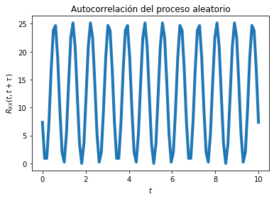

# Tema4
Laboratorio 4
Integrantes: 
Sebastian Herrera Esquivel - B93851
Isaac Stalley - B97756

En este laboratoiro se analiza un proceso estocastico de forma senosoidal X(t). Donde las variables aleatorias son C, Omega y Cita; ademas son estadisticamente independientes entre si.

En la primera parte se quiere visualizar el valor esperado. Se supone que Omega es una constante, donde arbitrariamente se elige el valor de w = 2*np.pi*60. 

Dado que Cita no es constante se deduce que el valor medio no va ser estacionario y va depender del tiempo.

Seguidamente se modifica el codigo brindado por el profesor donde se crea el vector tiempo, y se crean 10 funciones del tiempo x(t) con t puntos.
Finalmente se grafica el resultado teorico brindado por el ejercicio 4 y la funcion obtenida del promedio de las realizaciones en cada instante de tiempo. 
 
.png)

Del cual se observa que efectivamente el valor esperado depende del tiempo y no es un valor constante, cambia con cada instante de tiempo.

En la segunda seccion del laboratorio se visualiza la autocorrelacion del proceso estocastico.

